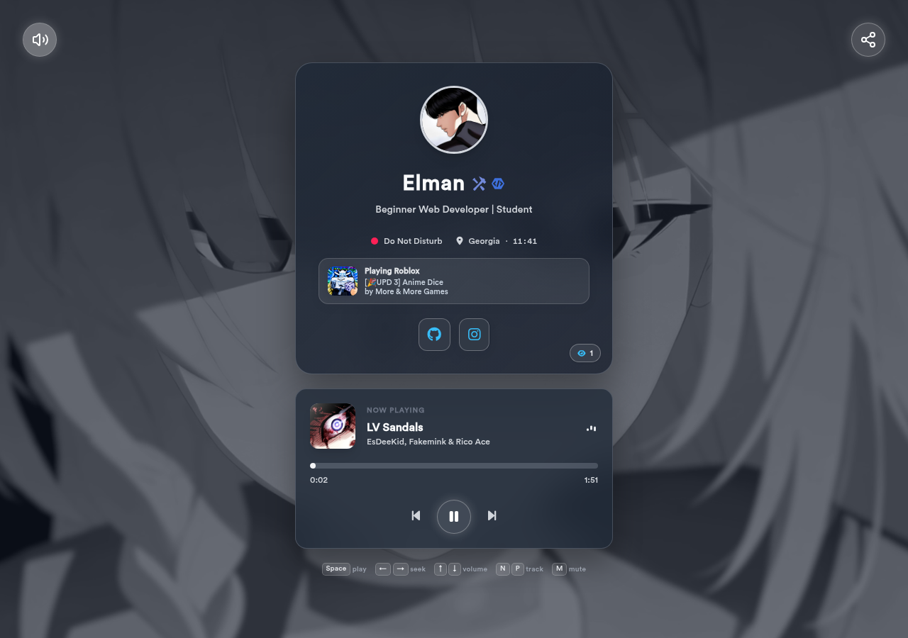
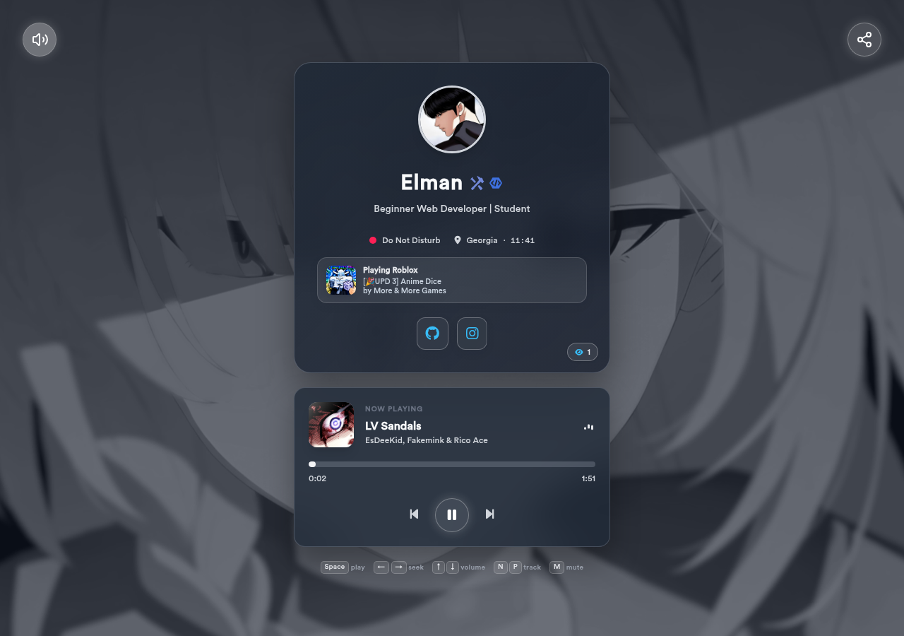

# Bio Portal

A lightweight personal bio-link page built with HTML, Tailwind CSS, and vanilla JavaScript. It pairs a glass-style profile card with social links, live Discord presence, a visitor counter, a video background, and a multi-track music player.





## Features

- Profile name, avatar, bio, badges, location, and social links configured from a single file
- Real-time Discord status through the [Lanyard API](https://github.com/Phineas/lanyard)
- Unique visitor counting through CountAPI and browser `localStorage`
- Play, pause, previous, next, seek, and volume controls for local audio tracks
- Light and dark theme styling controlled through `theme.js`

## Requirements

- Node.js and npm for rebuilding Tailwind CSS
- A local web server for development, because the page uses JavaScript modules

## Getting Started

1. Install the dependencies and start the Tailwind watcher:

   ```bash
   npm install
   npm run dev
   ```

2. Serve the project root with any static server. For example, with `serve`:

   ```bash
   npx serve .
   ```

The page can be deployed to GitHub Pages, Netlify, or any static hosting provider. Keep the project files and asset paths together when uploading the site.

## Customization

Most personal settings live in [`config.js`](config.js):

```js
window.config = {
	username: "Your Name",
	bio: "Your short bio",
	avatar: "./assets/profilepicture.jpg",
	background: "assets/background.mp4",
	songs: [
		{ audio: "songs/audio.mp3", title: "Song title", artist: "Artist" }
	],
	socials: [
		{
			title: "GitHub",
			url: "https://github.com/your-name",
			icon: "fa-brands fa-github"
		}
	]
};
```

You can add badges using an icon URL or an Iconify icon name. Social icons use Font Awesome classes. Replace the sample media in `assets/` and `songs/` while keeping the paths in `config.js` correct.

### Theme

`theme.js` exposes the following browser API:

```js
themeController.getTheme();
themeController.setTheme("light");
themeController.toggleTheme();
```

The current default is set by `forcedTheme` in `theme.js`. Change it to `"light"` or `"dark"` to choose the initial appearance. The theme preference is also stored in `localStorage` under `elman-theme`.

## Changing the Songs

Update the `songs` array in `config.js` and point each entry to a file in `songs/`. The player reads track metadata directly from the MP3 file, so each file should include its `TIT2` (title), `TPE1` (artist), and `APIC` (cover art) tags. You can add or edit those tags with a tool such as [banger.show's MP3 tag editor](https://banger.show/tools/mp3-tag-editor).

## Rebuilding CSS

Tailwind source styles are in [`src/input.css`](src/input.css), while the page loads the compiled [`src/output.css`](src/output.css). After changing Tailwind classes or source CSS, rebuild the output file:

```bash
npx @tailwindcss/cli -i ./src/input.css -o ./src/output.css
```

## Setting Up Discord Status

Open `discord.js` and replace the sample ID with your own Discord user ID. You also need to join [Lanyard's Discord server](https://discord.gg/lanyard) so your presence is tracked.

## External Services

- Lanyard provides the Discord status shown on the profile card.
- CountAPI stores the public visitor count. The namespace and key are defined in `database.js`.
- Font Awesome, Simple Icons, Iconify, Lucide, and Vanilla Tilt are loaded from CDNs in `index.html`.

The page still works as a static profile if one of these services is unavailable, although live status or visitor data may not update.

## Project Structure

```text
Bio Portal/
├── assets/              # Background video, avatar, favicon, custom font, and preview images
├── songs/               # Local audio tracks
├── src/
│   ├── input.css        # Tailwind source and custom styles
│   └── output.css       # Compiled stylesheet loaded by index.html
├── config.js            # Profile, media, badges, and social-link settings
├── database.js          # CountAPI visitor counter
├── discord.js           # Lanyard Discord status integration
├── index.html           # Page markup and CDN dependencies
├── script.js            # Profile rendering and audio-player behavior
├── tailwind.config.js   # Tailwind configuration
└── theme.js             # Light/dark theme controller
```

## Support

If you enjoy the project, you can support it on [Patreon](https://www.patreon.com/16736283/join).
